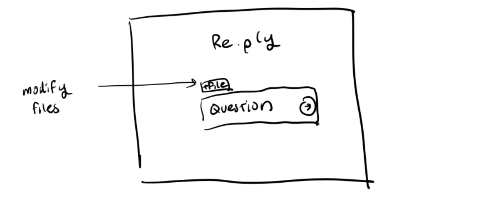
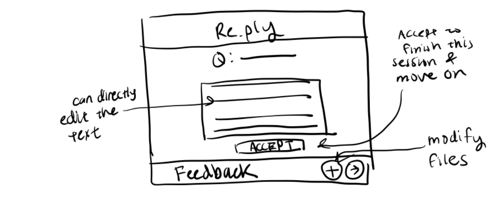

# Assignment 3

# Generator

## Spec

concept Generator


purpose: an interactive answer that can be generated and modified by an LLM and modified, accepted, and copied by a user through feedback

principle: after the LLM generates answertype to the question, if there is user feedback, it will regenerate its output. Otherwise, the user can edit it or copy it for their use.

state 

a question String
a draft String
an accepted Flag
a set of feedbackHistory String

actions

```
updateInput(files: File[]): 
effect: updates files used to generate draft

async generate(question: String, llm: LLM, files: File[]): (draft: String)

requires question is a valid question
effects generate a draft to the question using the files provided with accepted FALSE 

accept(): (draft: String)

requires question to exist and draft status is not accepted
effects set draft status to accepted

edit(llm: LLM, newDraft: String):

requires draft status is not accepted, draft already exists 
effects replaces current draft with newDraft, adds to feedback history 

async feedback(llm: LLM, feedback: string): (draft: String)

requires feedback to be a valid feedback for a draft, draft has not yet been accepted
effects adds to feedback history, generate new text with updated content based off all feedback so far and current files

```

## UI sketches



This is the homepage. Users can input their question (ie write a cover letter, tell me why I would be a good fit for this role) as well as upload/edit files (not covered in this concept).



This is the generation page. Users see their question at the top of the screen, and the LLM generates a response to their prompt. The users can directly edit the response (which is sent as 'feedback' to the LLM for future edits), or make generic feedback requests ('please include that I have worked for Amazon'). The user can also upload additional files, or remove files that the LLM is referencing to generate the draft. Once the user is satisfied, they can end the session by accepting the response, which then redirects them to a download page for the generated text. 

## Validators

Issue 1: When the user makes edits to their draft, the LLM creates a list of actionable feedback to keep in mind for future drafts. The LLM must output it in the format of a list of python strings

[Code that validates the output is parseable feedback](./generator.ts#L86-95)

Issue 2: Malformed question input - the question is not actually a question. We want to ensure that the user cannot input "43" and try to make the LLM generate something, we want the user to ask something job-related.

[Code that validates the input is a valid question](./generator.ts#L60-62)

Issue 3: Malformed feedback input - the feedback is not actually an actionable and confuses the LLM, ie another question or nonsense. If we do not check this before adding to our feedback, we could end up with bogus feedback.

[Code that validates the input is a valid feedback](./generator.ts#L64-69)

## Changes in prompts

### Generate

Start: 
```
${this.question}
```

It didn't provide a good response, and also gave a lot of fluff. I just wanted to try out using only to prompt to see how well it would do.

Middle:
```
You are an expert job application writer. Use the following files as context:\n` +
            files.map(f => `File: ${f.name}\nContent: ${f.content}\n`).join('') +
            `\nBased on this user's question, "${this.question}", draft a comprehensive response.
            `;
```

It was outputting potential improvements, which I didn't quite like. It also would output an additional argument about how good of a job it did, and why it wrote a good cover letter (or did a good job of responding to the prompt), which I didn't  like.

Final:
```
You are an expert job application writer. Use the following files as context:\n` +
            files.map(f => `File: ${f.name}\nContent: ${f.content}\n`).join('') +
            `\nUser question: "${this.question}".
            Instructions: Respond directly and only with the answer to the question. Do NOT include greetings, explanations, or extra commentary. Output only the requested text.
            `;
```

This one does pretty well, and seems that it only outputs the text that the user wants instead of additional fluff. 

### Edit 

Start:

```
You are an assistant that analyzes revisions to writing.  
You will be given two drafts of text: Draft A (original) and Draft B (revised).  

Your task:
1. Compare Draft A and Draft B.  
2. Identify what types of changes were made (e.g., tone, clarity, structure, word choice, level of detail, formatting, conciseness).  
3. Infer the possible feedback or instruction that caused those changes.  
4. Summarize the feedback as **general writing guidelines** that can be applied to future drafts.  

Be concise and actionable. Output in bullet points.  

Example:  
- If Draft A is casual and Draft B is more formal, the feedback might be: *"Write with a more professional tone."*  
- If Draft A rambles and Draft B is shorter, the feedback might be: *"Be more concise and remove unnecessary detail."*  

---

Draft A:  
{draftA}

Draft B:  
{draftB}

Output:
```

This output stuff that was really hard to parse, and I struggled to add it to feedback. I realized I had to organize it in a way that could help it consistently parse.

Middle:
```
You are an assistant that analyzes writing revisions.

You will be given two drafts: Draft A (original) and Draft B (revised).

Your task:
1. Compare Draft A and Draft B.
2. Infer the feedback that likely caused the changes.
3. Return the feedback as a JSON array of short, actionable strings.

---

Draft A:
[INSERT ORIGINAL DRAFT]

Draft B:
[INSERT REVISED DRAFT]

Output:
["Write with a more professional tone", "Be more concise"]
```

The output was sort of inconsistent and would sometimes include "json" and sometimes not, and sometimes it would output a little bit of fluff, which made parsing pretty difficult.

Final:

```
You are an assistant that analyzes revisions to writing.  
You will be given two drafts of text: Draft A (original) and Draft B (revised).  

Your task:
1. Compare Draft A and Draft B.  
2. Identify what types of changes were made (e.g., tone, clarity, structure, word choice, level of detail, formatting, conciseness).  
3. Infer the possible feedback or instruction that caused those changes.  
4. Return the feedback as a Python list of short, actionable strings.  
5. Output only the Python list—no explanations, no extra text.

Example outputs:
["Write with a more professional tone."]
["Be more concise and remove unnecessary detail.", "Use active voice instead of passive voice."]

---

Draft A:
[INSERT ORIGINAL DRAFT]

Draft B:
[INSERT REVISED DRAFT]

Output:
```

So far it works, but my concern is that if I do a lot of feedback, the context window might get too large and it could forget. However, I am being frugal and I have not yet tested a lot of changes, but it so far seems fine.

## Identifying poor input
start: 
```
Determine if the following input is a valid ${item}. Respond with "Yes" or "No".\n\nInput: "${input}"\n\nAnswer:
```

This did REALLY poorly. In fact, it was trying to interpret '32' to mean something. 

See below:

```
**Interpretation 3: The user wants to elaborate on a specific aspect that is implied by "32".**

This is the most ambiguous interpretation. "32" could be a code for something specific to the user's process.

**If you have any more context on what "32" might refer to, please provide it, and I can give you a more tailored revision!**

**In summary, without more information, I've provided two potential revisions: one focusing on quantifying achievements (if "32" represents a number) and another focusing on slight conciseness.** Please let me know if you can clarify the feedback!
```

So I will be editing it to include more context, so that it is not a zero-shot prompt..

Middle:

```

You are a strict classifier.

Determine whether the input is a valid request for feedback on a piece of writing.

Classify as "Yes" only if ALL of the following are true:
1. The message explicitly asks for **feedback, critique, or evaluation** of a piece of writing, such as a draft, essay, paragraph, or response.
2. The message includes or clearly references the **text to be reviewed** (e.g., “here’s my draft,” “can you review this,” followed by text).
3. The message refers to **improvement or evaluation** (e.g., “how can I make this better,” “what do you think,” “give me feedback”).

If any of these conditions are missing — for example, if the message just asks for writing help, general advice, or produces new writing — classify as "No".

Examples of "Yes":
- "Can you give me feedback on my cover letter draft below?"
- "Here's my essay — what do you think of it?"
- "Review this paragraph and tell me how to make it better."

Examples of "No":
- "Write me a cover letter."
- "Summarize this text."
- "Explain this sentence."
- "Hi"
- "43"

Respond with exactly one word: Yes or No.

Input: "${input}"

Answer:
```

It does a better job now, it can identify if something is a poor question/feedback now. However, for the feedback, it output this:

```
 I need more information to revise the draft. Please provide:

*   **The current draft of the text.**
*   **What the "32." refers to.** Is it a page number, a section number, a comment number, or something else?
*   **The specific feedback you want me to address related to "32."**

Once you provide these details, I can help you revise the draft.
```

I want it to avoid putting any conversation or fluff inside the output, so I want to revise the prompt to do this. It also is too strict at times, so I need to fix that. For example, saying "make it more concise" is rejected..

Second Iteration

```
You are a strict text classifier.

Determine if the input is a message asking for help writing or improving materials related to a job or internship application.

Classify as "Yes" if the message:
- Asks for writing or editing help with any job application–related content, such as:
  - cover letters
  - "why fit" or application question answers
  - LinkedIn summaries or professional bios
  - personal statements
  - other professional profile or application materials
- May mention a company or position (e.g., "cover letter for Google SWE") OR clearly refers to professional/job application writing (e.g., "Draft a LinkedIn summary").

Classify as "No" if the message:
- Is unrelated to job or professional applications.
- Asks a general question, performs math, or contains only numbers, greetings, or casual conversation.

Examples of "Yes":
- "Write a cover letter for a software engineering internship at Google."
- "Why would I be a good fit for this role at Meta?"
- "Draft a LinkedIn summary."
- "Help me write a personal statement for a data analyst position."

Examples of "No":
- "Write me a story."
- "What is 1+1?"
- "43"
- "Hello."
- "Explain recursion."

Respond with exactly one word: Yes or No.  
Do not include any explanations or reasoning.

Input: "${input}"

Answer:
```

It is still classifying too strictly. Will also work on fixing my regeneration prompt.
It is really hard to get it on the right balance between strict and not strict, and I'm still running into issues where it is incorrectly classifying what is a good question and what isn't. For example, it still rejects the linkedin summary, but now it's accepting non-specific material.

Final iteration before i give up 

```
You are a strict text classifier.

Determine if the input is a message asking for help writing or improving materials related to a job, internship, or professional application.

Classify as "Yes" if the message:

Asks for writing or editing help with any professional application or profile content, such as:

cover letters

answers to “why fit” or other application questions

personal statements

LinkedIn summaries, professional bios, or resumes

other materials for jobs, internships, or professional profiles

Mentions a company, position, or platform (e.g., LinkedIn) OR clearly refers to professional writing (e.g., “Draft a LinkedIn summary,” “Write my bio for work”)

Classify as "No" if the message:

Is unrelated to job or professional applications

Asks a general question, performs math, or contains only numbers, greetings, or casual conversation

Respond with exactly one word: Yes or No
Do not include any explanations or reasoning.

Input: "${input}"
Answer:
```

Now it is too general, unfortunately. I think it is very difficult to reach a happy medium, but for user experience, I've concluded a better experience is hallucinatinos over it refusing to answer a general job application related question.